# Overview

This write-up is for the BSides Tampa 2026 Badge CTF.

YouTube video, soon I promise

Overall information about the Badge CTF for Bsides Tampa 2026 [BSides Badge CTF Page](https://bsidestampa.net/activities/badge-challenge)

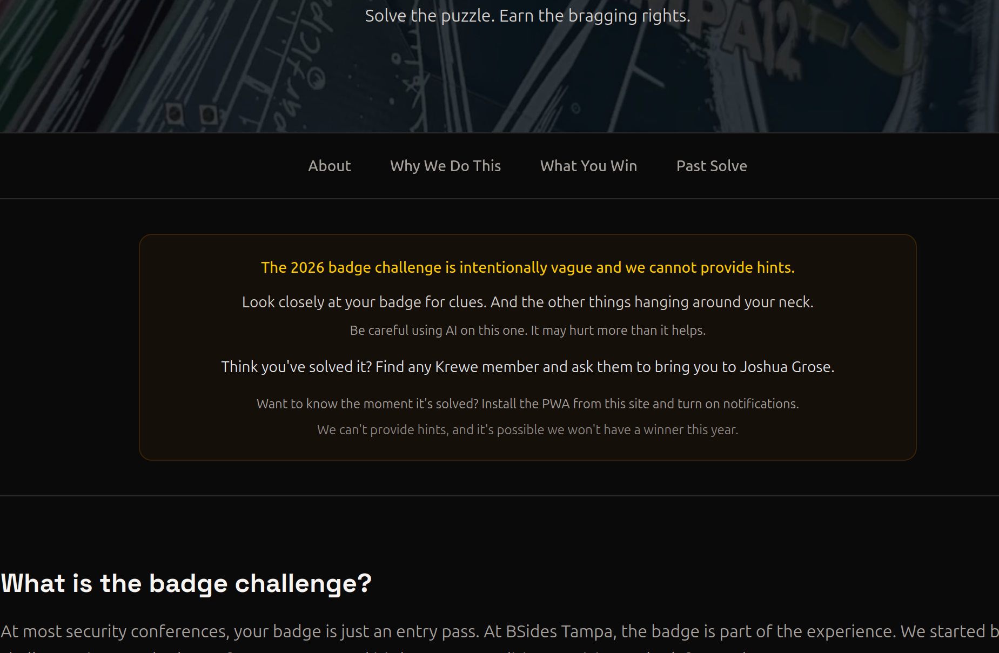


# Main Badge Back

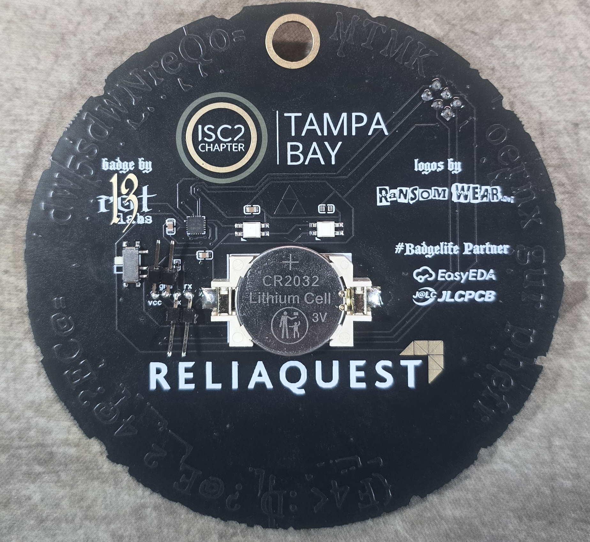

The CTF begins on the back of the badge, reading clockwise from the 9 o’clock position. The first string ends with an = sign, which is often a clue that it is Base64-encoded.

`dW5sdWNreQo= MTMK` = unlucky 13

Trying to Base64-decode the remaining strings does not work, but the decoded phrase gives us a hint: 13. The only cipher with 13 in its name is Rot13.

`oernx gur phefr` = break the curse

The last string on the badge is not encoded with ROT13. Since it includes a wider range of symbols and characters, I tried ROT47, which supports the extra characters.

`{F4< :D ?@E 2 4@?EC@=` = Luck is not a control

# Land-yard

The Front of the badge still couldn’t be decoded. The Badge CTF website note said to check EVERYTHING, including what's “around your neck”. When looking at the Land-yard, you would have seen that there was a long string and more of those weird characters on the land-yard.

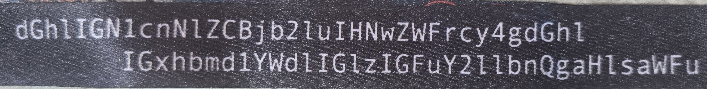

Decoding this string with Base64 reveals the following clue (It was the first thing I tried)

`dGhlIGN1cnNlZCBjb2luIHNwZWFrcy4gdGhl IGxhbmd1YWdlIGlzIGlzIGFuY2llbnQgaHlsaWFu` = the cursed coin speaks. The language is ancient Hylian.

Now we know that the unusual characters are written in Ancient Hylian. A quick comparison shows that there are multiple versions of the Hylian language across different Zelda games. Matching the symbols against the different games will lead to the Wind Waker version of Hylian, which makes sense given that this year’s theme is pirates.


## The Unintentional Trap
Now that we have the key to the Hylian language, we should be able to decode it.


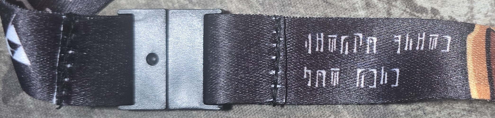

* laniard = `SOHAHOSUAKA WOHEHAHOKO UKAHO SUKORUKO` 
* Top right of the badge = `SUHEHEHIHO ATECHIAKUTAO13` 
* Bottom left of the badge = `TEHAHETSUKACHIUKAHEKO SAOSE`


Now, this is where a lot of people, including me, got stuck, since we were trying to translate Hylian into either Japanese to English, or Hylian into English using English phonics. Both would just give us nonsense. Someone on the third floor eventually pointed out that there is a Hylian-to-English keyboard mapping. From there, everyone started experimenting with different key mappings instead of treating the symbols as Japanese. The only keyboard map that made any sense was this one, which was partly cut off. 

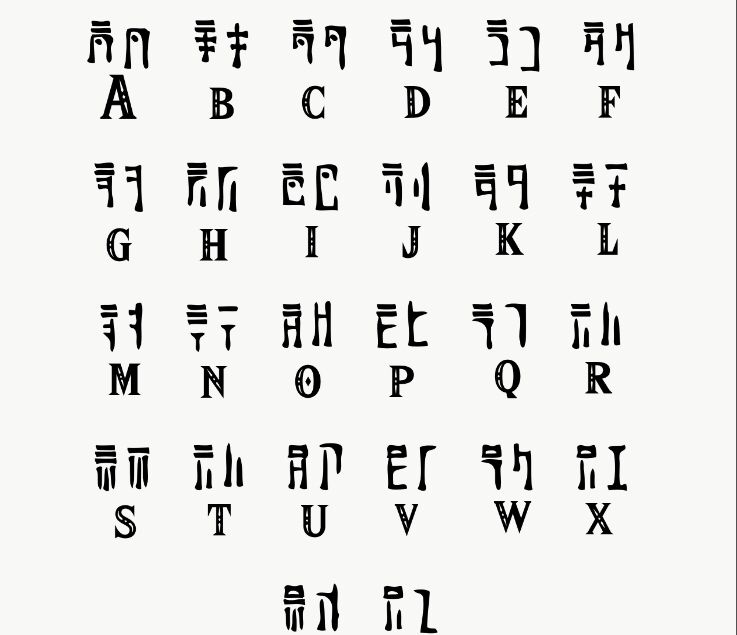

For real this time, we can finally decode what on the land-yard. 

laniard = `Joshua Grose was here`

> Joshua Grose is the person who made this CTF and the crazy-looking badge. 

Welp this was a red herring. Lets look at the main badge.


# Main Badge Front

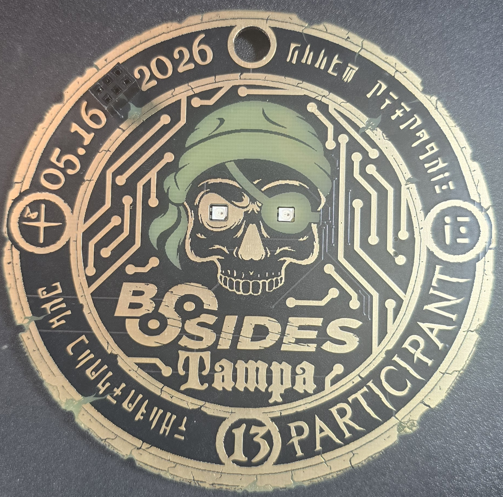

Now, when looking at the badge, I started at the top right since the 13 was already decoded. You should get the following if you used the cut-off key map.

* Top Right of badge `https unlucky13`
* Middle left `13` 
* Bottom left of the badge `notmalware fyi`

Just trying https://unlucky13 doesn’t take you anywhere, but if you try http://notmalware.fyi, you will get the feeling that someone will never give you up. (^-^) But if you combine the two strings, you will get https://unlucky13.notmalware.fyi which finally takes you to the real CTF. (\ ;-;)\ I already spent 5 hours on this.

# Main Site

[https://unlucky13.notmalware.fyi/](https://unlucky13.notmalware.fyi/)

The Home Page to the real CTF site (😭 I got here on sunday)

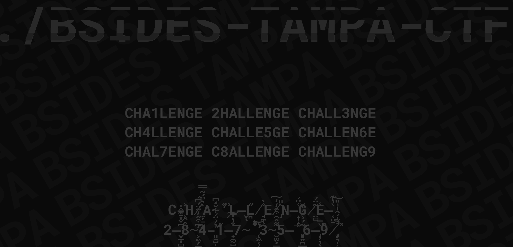

When viewing the source page you can see following.

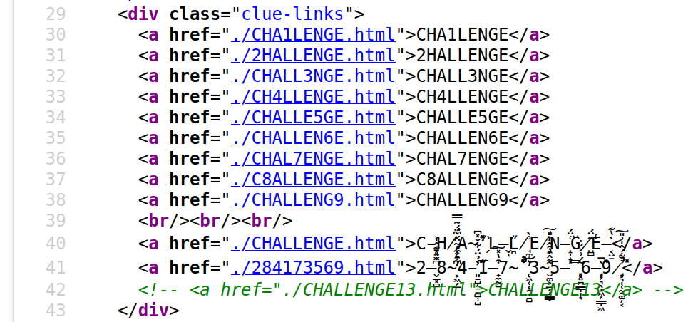

There are 13 challenges that might we need to complete. 

- CHA1LENGE
- 2HALLENGE
- CHALL3NGE
- CH4LLENGE
- CHALLE5GE
- CHALLEN6E
- CHAL7ENGE
- C8ALLENGE
- CHALLENG9
- CHALLENGE
- 284173569
- CHALLENGE13

## Challenge 1

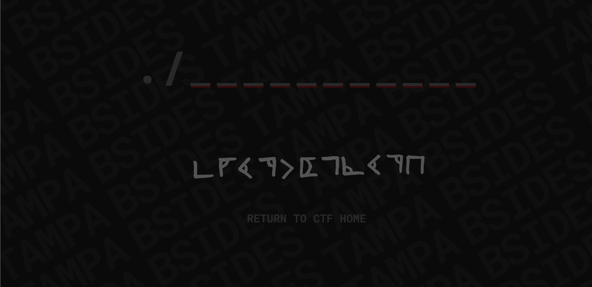


The First Challenge is clearly a modified version of the Pig Pen cipher. Replacing the angle thing with dots will allow you to decode the first cipher. If you didn’t know it was a Pig Pen cipher, then you can reverse image search for something similar, which would bring you to Pig Pen cipher.

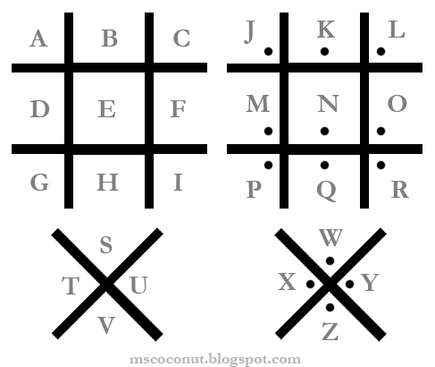

The first answer is `cryptoglyph`


>  An important note: 
> 
> * The amount of underscore on each challenge page, will give you a hint on how long the answer is. Example: ./___________ = ./cryptoglyph
> * Is that you can check your answer with entering it at the end of the site URL. Example: https://unlucky13.notmalware.fyi/cryptoglyph

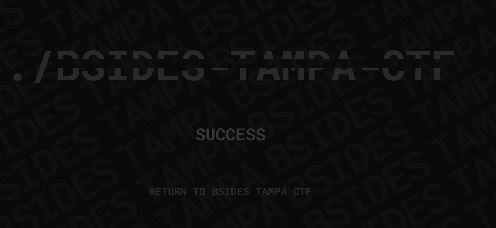

## Challenge 2

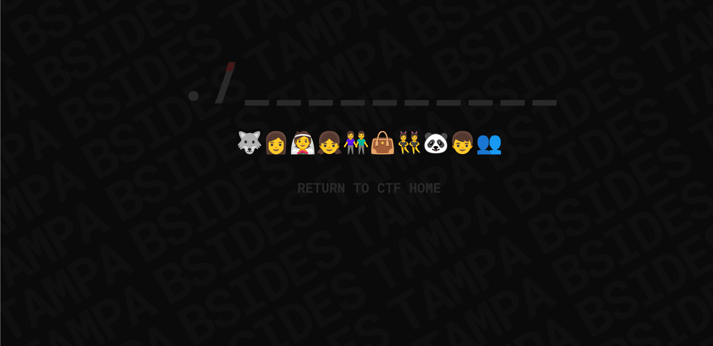

The second Challenge is where you want to start using tools like [dcode.fr Cipher identifier](https://www.dcode.fr/cipher-identifier) to help identify ciphers you will deal with. When you put the emojis into the cipher identifier, it will tell you it's very likely Base100. When you decode the base100 the answer will be the following:

🐺👩👰👧👫👜👯🐼👦👥 = `cryptexeon`

## Challenge 3

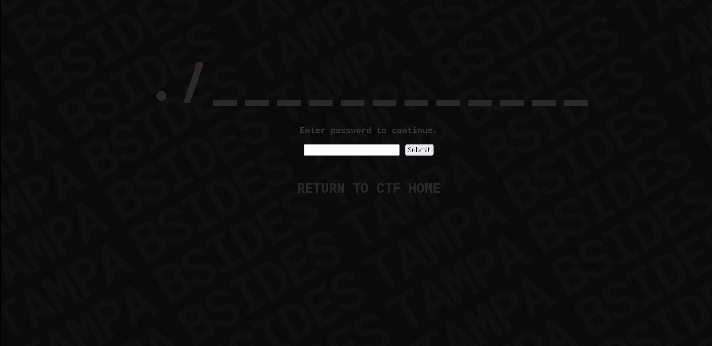

Challenge 3: You need to know a little bit about how sites work. When you inspect/ view the source page, you will see the script block that holds the logic on how the input box works.

```bash
    <script>
      function checkPassword() {
        const inputEl = document.getElementById("password");
        const resultEl = document.getElementById("result");

        if (!inputEl || !resultEl) return;

        const input = inputEl.value.trim(); // IMPORTANT: avoids whitespace exploits
        const encoded = "ZXJpb21pcmdhdGFk";
        const transformed = btoa(input.split("").reverse().join(""));

        if (transformed === encoded) {
          resultEl.textContent = "Access Granted";
        } else {
          resultEl.textContent = "Access Denied";
        }
      }
    </script>
```

When you look at this code, you see this order of operation: first, the leading and trailing spaces are removed from your input. Next, it will reverse the text, then encode your input with base64, and finally compare it to the hard-coded password. To get the password it is looking for, we need to do the opposite. The answer is `datagrimoire`
```
ZXJpb21pcmdhdGFk -{base64 decode}-> eriomirgatad -{Reverse Text}-> datagrimoire
```
> NOTE: You can use CyberChef to do this. Here is the [Recipe](https://gchq.github.io/CyberChef/#recipe=From_Base64('A-Za-z0-9%2B/%3D',true,false)Reverse('Character')) 
> 
> I recommended that you have an offline copy of CyberChef so you don’t need the internet to use it.


## Challenge 4

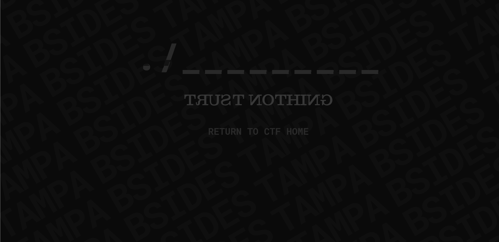

Challenge 4 is another challenge that requires you to look at the page's source code. When you do, you will notice that the style block is what is making the clue look the way it does.


```jsx
    <style>
      @font-face {
        font-family: "ctfFont";
        src: url("/fonts/CTF.woff2");
      }
      
      .clue {
        font-family: "ctfFont";
      }
    </style>

```

It looks like the font is being loaded from/fonts/CTF.woff2 file. If you download that file and open it in Notepad or another basic text editor, you will not see anything useful because .woff2 is a compressed font format, not a plain text file.

When you open the file in an online WOFF2/font viewer, some sites show all of the available glyphs in the font, while others only display sample preview text. In this challenge, the font contains a hint: getting closer…

If you were lucky, the viewer you used may have displayed the flag immediately. However, some viewers may not show it because they only render common characters, use their own sample text, or do not display all the glyphs in the font. The flag may be stored as custom glyphs, private-use characters, or characters that are not shown unless the viewer maps and renders the full character set.


The Site I used [Web_Link](https://fontdrop.info/#/?darkmode=true)

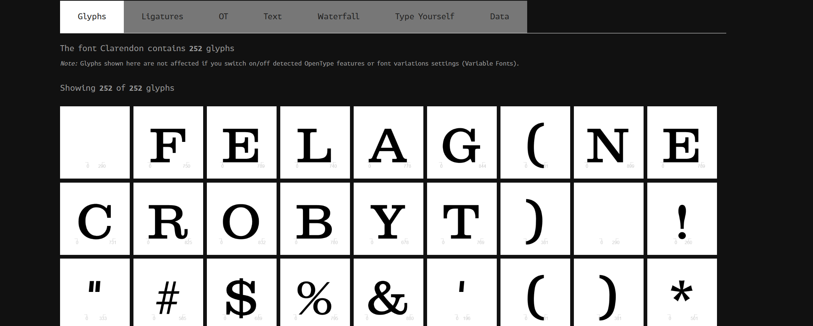

You will notice that the flag is misspelled and one letter short, so you took the e and added it to the flag, and you get the real flag, `NecroByte`. 

>NOTE: I had to play around with the casing since it was all upper case.

## Challenge 5

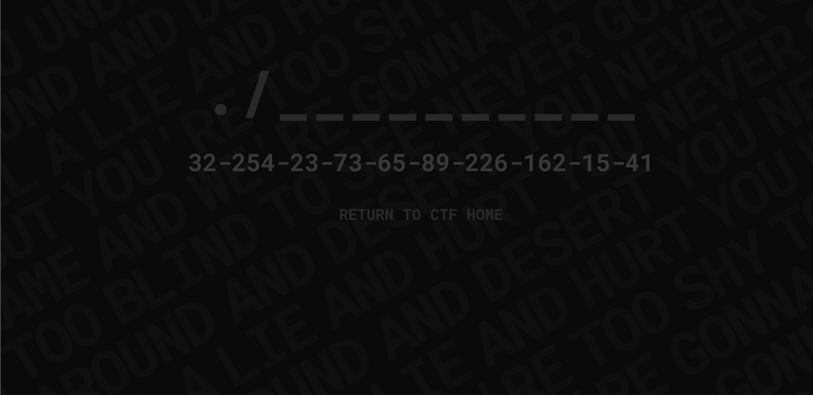

Challenge 5 is where each challenge got hard for me. The numbers didn’t directly translate to anything. So, looking at the source, I notice that the script is trying to load a file called `lyrics.txt`, but it didn't exist.

```
<script>
      fetch("./lyrics.txt")
        .then(r => r.text())
        .then(text => {
          document.querySelector(".bg").content = text;
        });
    </script>
```

I did notice that one of the link heads to `lyrics.css` was close enough.

```
    <link rel="stylesheet" href="./lyrics.css">
    <link rel="stylesheet" href="./CHALLE5GE.css">
```

When you open this file, you get the lyrics to the Rick Ashley song Never Going to Give You Up.  

```jsx
:root {
  --lyrics: "We're no strangers to love You know the rules and so do I A full commitment's what I'm thinkin' of You wouldn't get this from any other guy I just wanna tell you how I'm feeling Gotta make you understand Never gonna give you up Never gonna let you down Never gonna run around and desert you Never gonna make you cry Never gonna say goodbye Never gonna tell a lie and hurt you We've known ..." (NOTE: I cut the rest of it off since it WAS SOOO LONG for this write-up)
}
```

This is where the numbers finally come into play. The lyrics.css file contains the text we need, and the numbers act as the key.
In programming, strings are usually indexed by position, meaning each number can point to a specific character in the text. For example, index 32 points to the letter n. So doing the next four letters would come out to `neonc`, which was a real word. So the whole thing is the following:

32-254-23-73-65-89-226-162-15-41 = `neoncipher`

## Challenge 6

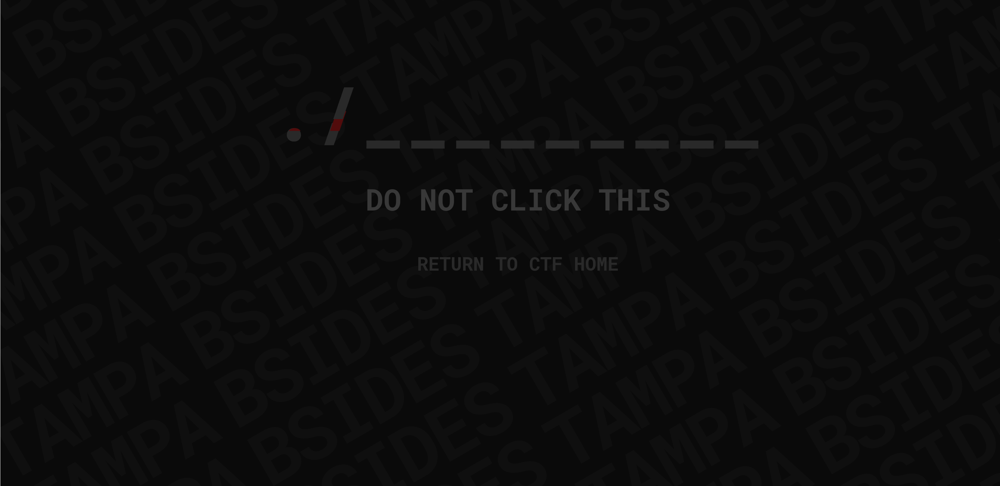

Challenge 6, The meta stat at this point is to check the page source right off the bat. 

```jsx
<script>
      function hexDecode(hex) {
          return hex.match(/.{1,2}/g).map(byte => String.fromCharCode(parseInt(byte, 16))).join('');
      }
      function dontdoit() {
          const container = document.getElementById('dont');
          container.onclick = null;
          const once = "6f68206e6f2e2e2e";
          const twice = "6e6f7720796f7527766520676f6e6520616e6420646f6e652069742e2e2e";
          const threetimes = "68747470733a2f2f70726f6261626c792e6e6f746d616c776172652e667969";
          setTimeout(() => {
              const firstText = document.createElement('div');
              firstText.className = 'hidden-text';
              firstText.textContent = hexDecode(once);
              container.appendChild(firstText);
              setTimeout(() => {
                  const secondText = document.createElement('div');
                  secondText.className = 'hidden-text';
                  secondText.textContent = hexDecode(twice);
                  container.appendChild(secondText);
                  setTimeout(() => {
                      window.open(hexDecode(threetimes), '_blank');
                  }, 2000);
              }, 2000);
          });
      }
  </script>

```
Looking at this script block, the three const strings are only hex-encoded, which is easy to decode, but it seems the last string opens a new window.

* `6f68206e6f2e2e2e` = `oh no...`
* `6e6f7720796f7527766520676f6e6520616e6420646f6e652069742e2e2e` = `now you've gone and done it...`
* `68747470733a2f2f70726f6261626c792e6e6f746d616c776172652e667969` = `https://probably.notmalware.fyi`

Since the site was of no help to us. Thanks Rick

Another spot to look at was this div block.

```jsx
     <div class="clue">
      <div id="dont" onclick="dontdoit()">DO NOT CLICK THIS</div>
      <div id="hiddenClue" style="display: none;">
        krqbPbanA
      </div>
```

The first thing I tried was to Rot13 decode it, and it showed the answer, but it was reversed, which was an easy fix.

```AnabPbqrk -{Rot13}-> xedoConaN -{reverse}-> NanoCodex ```

## Challenge 7

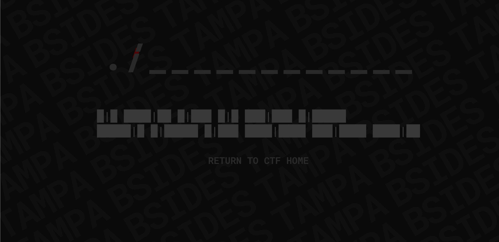

Challenge 7 took a bit to figure out, but it was a Polybius square where the `|` pairs. (AI really started to help out here)

```bash
█|█ ████|██ █|███ █|█ ███|███ █|█████
█████|█ █|█████ █|███ ████|████ ███|████ ████|██
```

Since each black block represents one count, you can get the correct number pair by counting how many blocks are on each side of the | separator.

For example:

- `█|█` = `1,1`
- `████|██` = `4,2`
- `█|███` = `1,3`


```jsx
█|█ ████|██ █|███ █|█ ███|███ █|█████ █████|█ █|█████ █|███ ████|████ ███|████ ████|██ =  11 42 13 11 33 15 51 15 13 44 34 42
```
Standard polybius table

```jsx
    1  2  3  4  5
1   A  B  C  D  E
2   F  G  H  I/J K
3   L  M  N  O  P
4   Q  R  S  T  U
5   V  W  X  Y  Z

```

The answer you will get is `ArcaneVector`

> NOTE: AI was helpful in some places, but it made understanding the Hylain language SO MUCH WORSE.

## Challenge 8

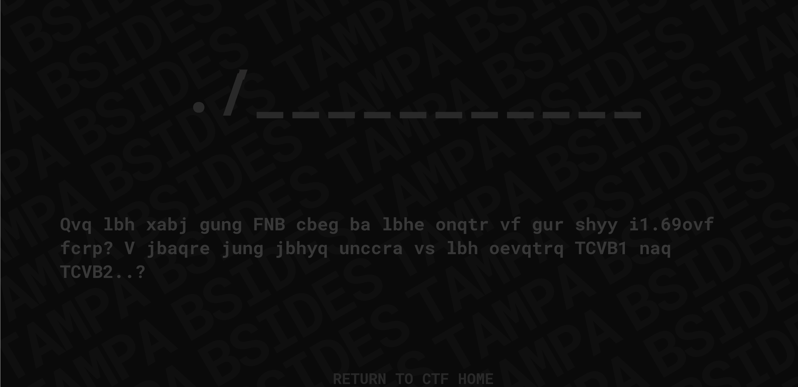

Challenge 8 was a lot easier than the others, but the first thing to do was decode this, and it looked like every other Rot13 cipher. 

```bash
"Qvq lbh xabj gung FNB cbeg ba lbhe onqtr vf gur shyy i1.69ovf fcrp? V jbaqre jung jbhyq unccra vs lbh oevqtrq TCVB1 naq TCVB2..?"
  =   
"Did you know that SAO port on your badge is the full v1.69bis spec? I wonder what would happen if you bridged GPIO1 and GPIO2..?`"
```

Now, the funny thing was, I found the answer by doing my own thing, rather than the intended path. I will show the intended path first, then how I found it. (NOTE: I was doing this on Sunday, which was after the con)

### Intend Path

The intended path is to jump the **GPIO1** and **GPIO2** on the board. You can use this site to help you find those pins.

[https://hackaday.io/project/175182-simple-add-ons-sao](https://hackaday.io/project/175182-simple-add-ons-sao)

Once you jump the two pins, the right eye of the badge will start blinking in Morse code. And when you decode it, it will read `OmegaTemple`


### My Path 
I found this out on Saturday: I saw a chip on the badge, which was new compared to last year's.
So on Sunday morning, I dumped the chip's firmware, then did the challenges WAY later in the day and found the answer in the dump.

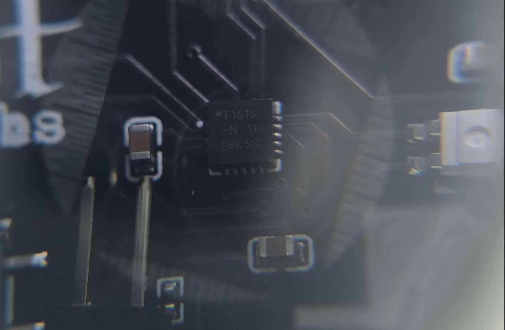

The first thing to do was figure out what chip was on the board. Under a microscope, we can see that it's a T1616 chip. Googling this chip shows it's a Tiny1616 chip.

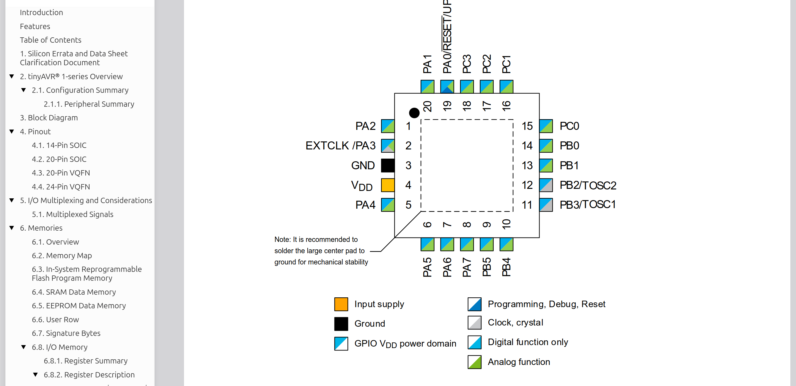

To confirm it was the right model we had. I had the pin-out documentation for the whole Tiny1616 chip. Using the microscope, we were able to determine that it was a 20-pin microchip. When we jump the **GPIO1** and **GPIO2** pins, the traces lead back to PC2 and PC1 pins on the microchip. [ATtiny1614-16-17-DataSheet](https://ww1.microchip.com/downloads/en/DeviceDoc/ATtiny1614-16-17-DataSheet-DS40002204A.pdf) 

#### Dumping the tiny 1616 chip

Now that we know that it was indeed a tiny 1616 chip, we know the chip will be talking over the UART protocol. On the back of the badge, you will see four pads labeled **VCC**, **GND**, **RX**, and **TX**. I solder header pins because I didn’t want to use bare wires and wanted the ability to remove them without looking like poop.


UART protocol uses a few basic pins to send and receive serial data between two devices.

* VCC: Power supply for the device.
* GND: Ground reference. Both devices must share ground.
* TX: Transmit pin. This sends data out.
* RX: Receive pin. This receives data in.

Funny thing about RX and TX, they need to be cross, so TX needs to go to RX on the other board. So it will look like this:
```
Device A TX  ->  Device B RX
Device A RX  <-  Device B TX
```
Now, the board I used is a Tigard board, which is overkill for this, but I love this thing because I only need to carry one around to do almost everything, hardware-hacking-wise. [https://github.com/tigard-tools/tigard](https://github.com/tigard-tools/tigard)  

The wiring will look like this:

| Tigard | 1616 Chip |
|--------|-----------|
| VCC    | VCC       |
| GND    | GND       |
| RX     | TX        |
| TX     | RX        |

> NOTE: You don’t need VCC and GND if you are going to use the coin battery as power. I had my badge off, so I gave it power.

Command that AI gave me to dump the firmware

```avrdude -p t1616 -c serialupdi -P /dev/ttyUSB0 -U flash:r:dump.bin:r```

Looking in the dump file with Ghidra (the only thing that had AVR board support, TAKE THAT IDA, BINJA), the only string in the WHOLE DUMP FILE was the answer to the challenge:  `OmegaTemple`

> NOTE: I didn't fully look into the dump file as I now want this write up to be done ;-; I tired of this grandpa

## Challenge 9

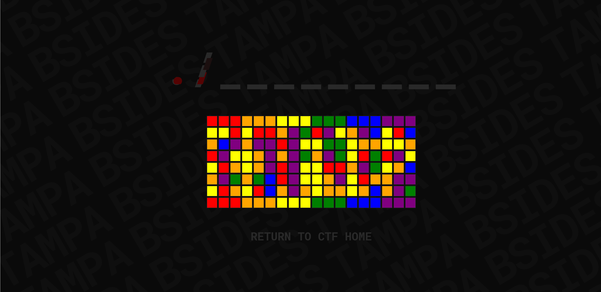

Challenge 9 gave me the hardest time, but AI was able to one-shot it. 

Raw output

```bash
RRROOOYYYGGGBBBPPP
YYRYRROPGRPYOPBYRB
OBPOPPRPYYGGYOOYYO
RPYYOPOPGOPGYRGRPY
YROYOPRPYYRROPGYOB
OPGOGBRPYYOPYROOPP
YROYRBOPOYOOYOBOPG
RRROOOYYYGGGBBBPPP
```
The top and bottom rows repeat, which suggests they are the key. The key gives us the color order:

```R O Y G B P```

Since there are six colors, we can treat them as base-6 digits:

```
R = 0
O = 1
Y = 2
G = 3
B = 4
P = 5
```

Then the encoded rows are split into groups of three. Each group is treated as a base-6 number, which is then converted to ASCII.

```
Example:

YYR = 220₆
220₆ = 84
84 = T
```

Doing this for the full grid reveals the message:

```THE FLAG YOU SEEK IS HERE: SIGILCORE```

Flag `SIGILCORE`

If you did this one by hand with AI, I applaud you.

## Challenge

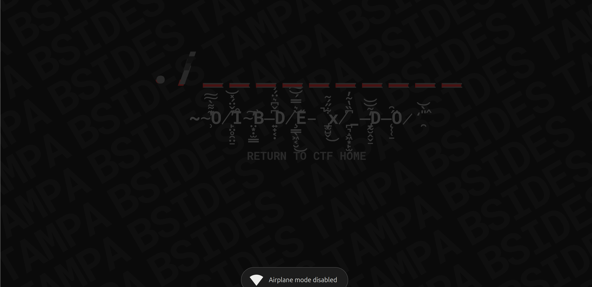

This challenge is one of the bottom challenges. The first thing is to either remove all the weird-looking letters so the clue is easier to read. Using the cipher identifier, we found that the strange text is caused by the Zalgo writing cipher. So, removing the Zalgo writing gives us this `OIBDEx_DO`. At some point, we were running out of obvious options, so we used CyberChef Magic Intensive Mode. The XOR option found the correct decoded value.

```jsx
~̴̹͊͌̀̕͠͠Ō̸̙̤̥̯̤̠̊́̌̈́̽͘̕͝Ì̴̤͙̣̫̳̕͠B̶͍̟͔̣͆̌͆͛̈́̾Ḑ̸̳̖͖͔̮̋̄̀͛̿́͜͝͠E̵̡̲̫̺̬͋̋́͂̚͜x̸̪͉̝͖͙̙̫̗͆̏̔̃̓_̶̡̱̰̮̭̬̠̒͂͝͝Ḋ̶̨̜̜̠́̑O̷̒̂̎͝  -{Zalgo Writing}-> ~OIBDEx_DO -{xor bruteforce}> TechnoRune
```

## 284173569

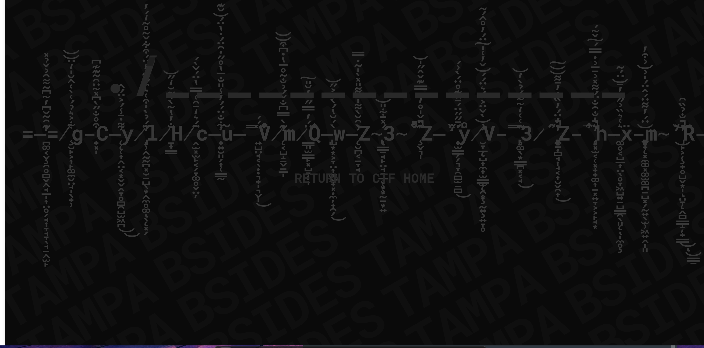

This was another challenge on the main page. Again, we noticed Zalgo writing, so the first step was to remove the extra Zalgo characters. After cleaning it up, we noticed the string contained `==`, which is a common sign of Base64 encoding. However, the `==` was at the front instead of the end, which suggested the string was reversed. The result still did not work as a URL path, indicating another layer of encoding. After trying a few more options, ROT13 gave us the final answer.


```bash
=̶̧̛̪͚͔̬̯̥̻̬̭̘̲̩͎̤̥̗̘͎̞̘̞̖̘̠̭̫̙͊̑̃̆͆̓͂͆͂͌̑͗̌̉̽͘̕͘≠̧̮̙͕͎̙͚̼̮̤̘̩̖̟̹͋͐͛̉́͑̀͑̂̆̍̒̈͝͝g̵̟͓̩͒̊̐̋̀͆̽̃̈̑̃͊͊͆C̶̨̨̛̜͎̭̤͔͙̬̬̭̞̥̻̯̺̫͖̪͌̇̄̾́͐̈́̂͜͜ÿ̷̡̨̹̭̰̰̪͓̮̠̺̖͙̭̼̥͚̖͓̗́̉̀̇͒͑͛̑͊͋̓̈́͒͋̌̃̊̃̒́̓̕̕͘ͅͅḻ̷̟̳̐̓̔͂̀̀͂̆̒̋͝Ḧ̸̭̫͓̫̙͔̗̞͚̥̬̤̦́͛̒̄̑͑̿̔̈́̌̀́͘c̶̛̛̟͍̮͈̗͎̜̳̰̆̆͋̐̈́́̓̾̎̐̅̔̊̋̇̑̈́̇̔̈́̆͊͝u̶͍̺̤̘͔̖̣̣͉̟̩͉̬̩̿̓̌̓̑̓̈́́͜V̷̨͔̺̝̱̬̱̲̩͊̀̿͆̐̌́͗̐̃̊̅̔̇͆͒͘̕͝͝m̷̳͈̫̳̙͓̺̞̹͎̍̑̈́̓̿̋̅̓̆̎͠Q̶̢̺͙͙͕̞̤͎͚̰̟͓̣̼̦̟̯̗̀́̆̔́̀̉͐̋͜͝ẁ̶̨̛̛̮̪͔̠̞̘̑̆̀͌̍͛͌̎̽̀̍̃̇̿Ź̴̢̹̳̠̘̙̤̘͉̲͙͙͙̰̠͙͍̽̄͋̎͝3̴̧̬͉̩̐̊̊͊̎̌̍̊̓̌̿͊̌̂̋̍̚͘̚͝Z̶̟̫̳̗̗͉̞̯̻̫̠̻̏̋̒̊̎́̄̋̋̈́̄̏͊̊̈́̀͗́͘͜y̷̨̨̧̧̛̛̮̞̲̺̟̼̟̫͇̫̯͙̰͍͍̞̥͗̀̌̈͐̈́͛̈́́̌̓͑̍̈́̓̊̂́̃͝͝͠V̵̢̧͚̖͙͇̪͓͔̘̿͊͑͑̒͂͌́̉̀̓͘͜͝3̷̢̡̢̯̱̣̻̘͎̘͔͎̮̬̯̟̋̑̍̓̈́̓̏̐̓̄͌͘̕̚͜͝͝͠Z̵̨̡͓̫͔̜͓̟̟͚͎̠͓͍̞͕͕̙̘͙̑̾̓̅͛̔̐̑̐̈́͌̽͗̄̅͗̇̿́̌̃́͘̕̚͠ḧ̶̨̧͚̥͔̺̲͎̤̖̥̞͖̺͍̠̺̳̯̖͈̩̼̥͛͑͛̏͗̋̀̓̄̈́̃͝ͅẍ̵̨̢̡̬̟͓̼͚͓͚̫͚̪̠̺͓̗̰͍̖̫̹͖͍̭̩͈́̓͌̈́̂̈́̍͗͗͒̓͝͝m̴̧̡̨̙͕̦̟̥̺̬͙̩̤̞̭̻͇̝̦̟̳̳̠̆̒̈̇̐̉̏̑̚̕͘͜͜͜͝ͅͅR̵̤̭̕  -{Zalgo Writing}-> ==gCylHcuVmQwZ3ZyV3ZhxmR 
=


==gCylHcuVmQwZ3ZyV3ZhxmR -{Revese}-> RmxhZ3VyZ3ZwQmVucHlyCg== -{base64 decode}-> FlagurgvpBenpyr
 -{Rot13}-> SyntheticOracle
```

## Challenge 13

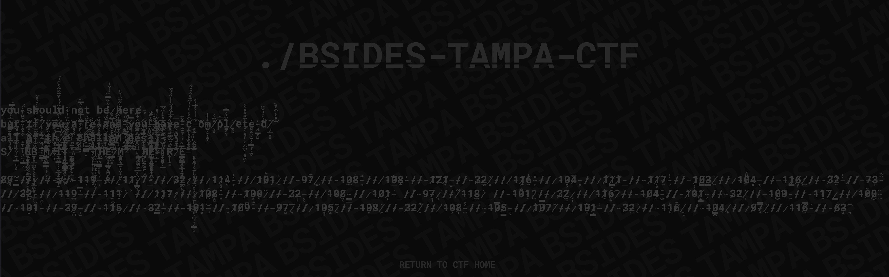

Challenge 13 seemed to be the final challenge, and it likely existed to tell us how to submit all of the flags we had collected. Like some earlier challenges, this one used Zalgo text to hide the real text. After removing the Zalgo characters, the message became readable. Once decoded, the text appeared to contain instructions for submitting the flags. There was also a sequence of numbers that looked suspicious. After testing, we found that the numbers were in ASCII encoding. Decoding the ASCII values revealed the final submission contact: Josh Grose’s email.


Zalgo Writing encoded 

```jsx
you should not be here.<br/>but if you are and you have completed <br/> all of the challenges,  <br/>SUBMIT THEM HERE<br/><br/>89 // // // 111 // 117 // 32 // 114 // 101 // 97 // 108 // 108 // 121 // 32 // 116 // 104 // 111 // 117 // 103 // 104 // 116 // 32 // 73 // 32 // 119 // 111 // 117 // 108 // 100 // 32 // 108 // 101 // 97 // 118 // 101 // 32 // 116 // 104 // 101 // 32 // 100 // 117 // 100 // 101 // 39 // 115 // 32 // 101 // 109 // 97 // 105 // 108 // 32 // 108 // 105 // 107 // 101 // 32 // 116 // 104 // 97 // 116 // 63<br/> -{ASCII Code}-> Josh Grose's email

```


## Full Answer Sheet

1 `Cryptoglyph`

2 `CryptexEon`

3 `datagrimoire`

4 `NecroByte`

5 `neoncipher`

6 `NanoCodex`

7 `ArcaneVector`

8 `OmegaTemple`

9 `SIGILCORE`

CHALLENGE `TechnoRune`

284173569 `SyntheticOracle`

CHALLENGE13 `Josh Grose's email`
