# Doom on a RAZ LTX/DC 25000 Vape

We've all seen people putting Doom on everything, including this video, [Doom on a pen vape](https://www.youtube.com/watch?v=rVsvtEj9iqE). But it had to be connected to another device to stream Doom to the vape, so it was really just another display. That means you need external controllers to play it.

## Story Time

I was at Hackerspacecon 2026 with some friends, doing what people do best. At some point, we got the idea of putting Doom on a vape with a screen, since they seem to be everywhere now. Right after the closing talk, we went to the nearest smoke/vape store to find a vape with a big screen.

We were trying to find a vape with an Android OS like the Swype vapes, but when we got to the store, they only had RAZ vapes and one other vape with a tiny screen. I don't remember the brand. We ended up getting the RAZ LTX 25000.

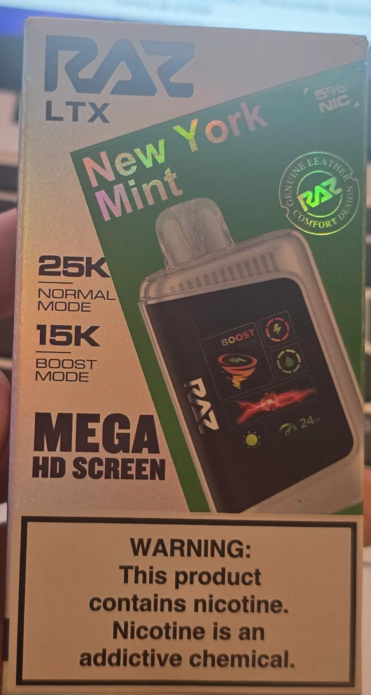

## Teardown and Research

Now that the vape had been selected and was heading back to the after-party at Hackspacecon, we started looking for anything about it in the lobby since it was raining. We found a [teardown video](https://www.youtube.com/watch?v=dFn5By8aqM8). Once we got the vape apart, it was really hard to see the main control board.

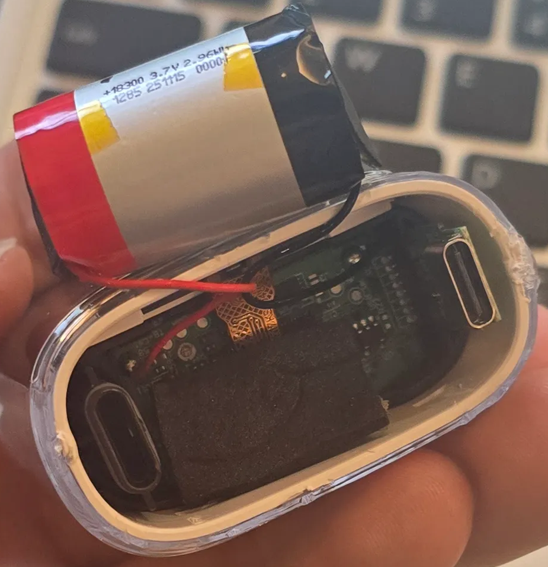

But the main chip said N32 something.

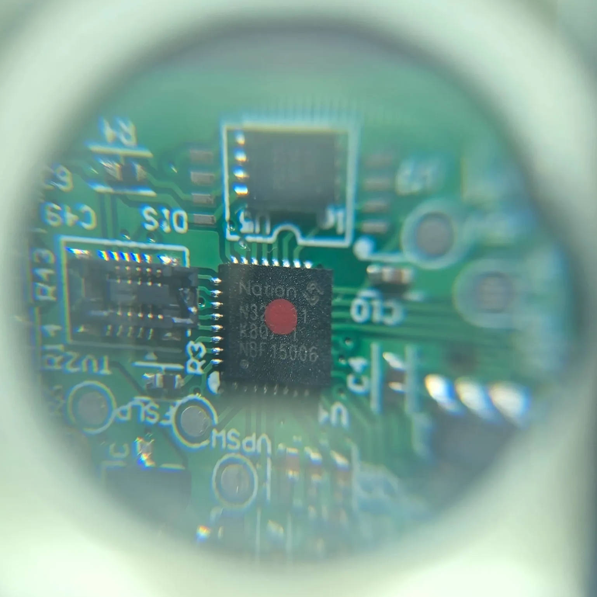

When we looked up `N32G031K8Q7` on Google, we found a guide and the chip manual for a similar vape, the RAZ DC25000. It turns out that was the old name for the vape we currently had in our hands.


While looking at the guide, we noticed this happened at the same conference and during the same after-party, just one year ago: [Praetorian's hardware hacking blog](https://www.praetorian.com/blog/hardware-hacking-a-nicotine-vape). This guide gave us a lot of information about the vape and other resources.

Now that we knew we could access the SWD port over USB, per the Praetorian blog, and since we didn't have any hardware to access SWD at the time, we shifted our focus to how to get the software info on the board to appear on the screen. A random Reddit post, which I can't find anymore, said that if you hold the button for more than 15 seconds, it will display debug info.

> Note: Praetorian took apart their vape only 10 feet away from where we were sitting at the after-party.

## Getting Into Debug Mode

Hold down the button for 15 seconds to show the software version and access the SWD port protocol.

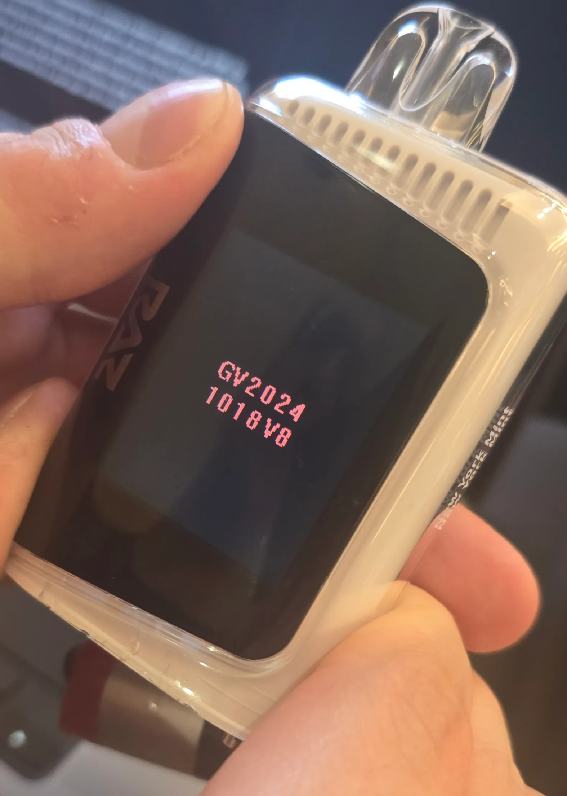

The white model version that we got:

```text
GV2024

1018V8
```

The blue model version that we picked up later:

```text
GV2024

0714V1
```

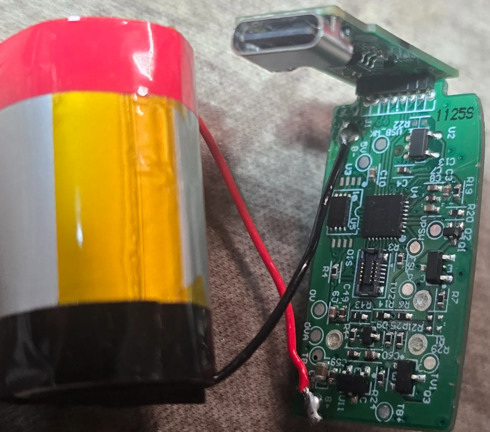

## After Hackspacecon

After Hackspacecon, I got to work on the vape and tried to dump the firmware. The first step was identifying which pins were used to communicate with the vape over USB. Using the documentation that ginbot86 had in their [ColorLCDVape-RE repo](https://github.com/ginbot86/ColorLCDVape-RE/blob/main/docs/KrazeHD7K-RazTN9000.md), I got a really good idea of which pins I needed to access the SWD port.

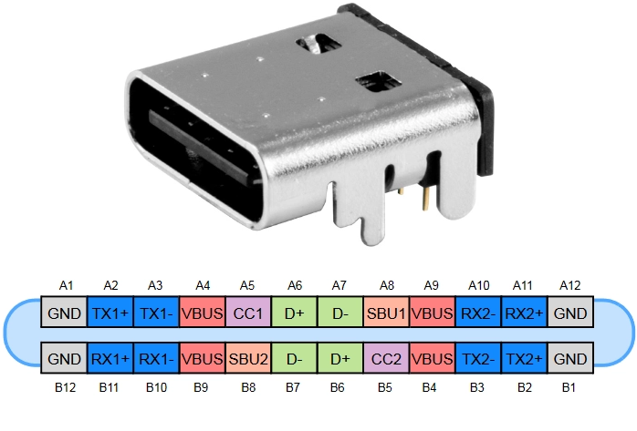

## Wiring the Vape

Hardware that I used:

- [Hacker Warehouse Tigard](https://hackerwarehouse.com/product/tigard/)
- [Adafruit SWD breakout board](https://www.adafruit.com/product/2743)

Wiring the Tigard to the SWD breakout, then to the Type-C breakout, then to the vape:

| SWD board | Type-C |
| --- | --- |
| SWDIO | CC1/A5 |
| SWCLK | CC2/B5 |
| GND | GND/A1 |

I used the Tigard as my interface board. You could use an ST-Link board to interact with the vape. Since the Tigard uses a Cortex connector, we need a breakout board to connect to the Type-C connector. You could cut the Type-C cord, and it would work.

> Note: Some Type-C cords only have power and no data wires.

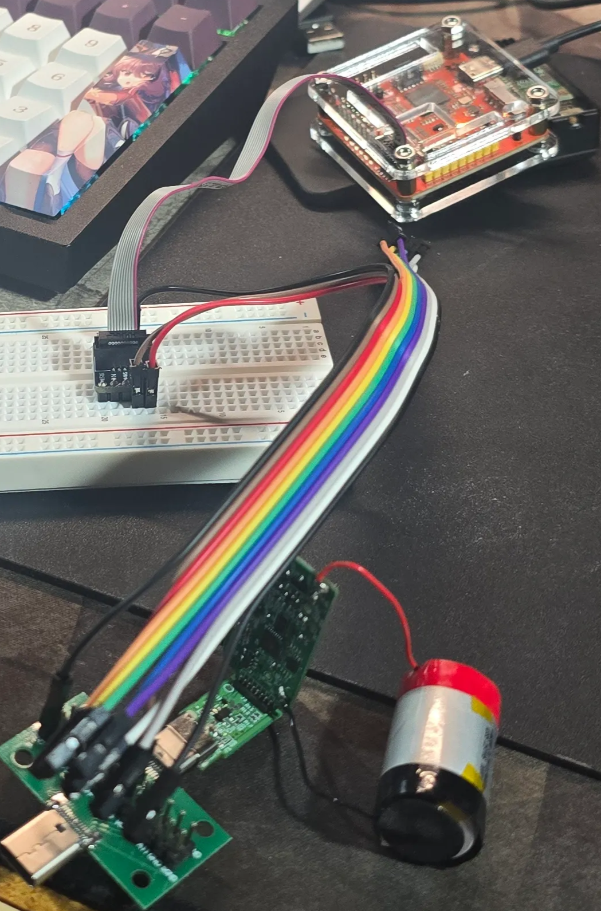

Once I got everything hooked up and tried using OpenOCD, I could not get the vape to connect to the computer. After searching Reddit, I found a post saying you need to enter debug mode to connect via SWD.

Now, using the CFG files from both Tigard and the RAZ-RE repo, I was able to dump the firmware.

- [Tigard GitHub repo](https://github.com/tigard-tools/tigard)
- [RAZ-RE GitHub repo](https://github.com/xbenkozx/RAZ-RE/tree/main/Firmware/openocd/scripts/target)

The command that I used to dump the firmware:

```bash
sudo openocd -f tigard-swd.cfg -f n32g0x.cfg -c "adapter speed 50" -c "init; halt; dump_image n32g031_firmware.bin 0x08000000 0x10000; shutdown"
```

At some point, we bricked the firmware while trying to flash a modified version.

Flashing the unmodified version of the firmware back onto the vape:

Terminal 1:

```bash
sudo openocd -f tigard-swd.cfg -f n32g0x.cfg
```

Terminal 2:

```text
telnet localhost 4444

reset halt
flash write_image erase n32g031_firmware.bin 0x08000000 bin
verify_image n32g031_firmware.bin 0x08000000 bin
reset run
shutdown
```


## Problems

So I slacked a little too much, and between heading to BSides Tampa and other things, I somehow managed to break the vape, and nothing worked anymore. I could no longer talk to the vapes over SWD. After spending a whole week trying to figure out what happened, making sure the wires were correct and that I hadn't broken the Tigard or any of the breakout boards, I accidentally jumped the two GND pins together while trying to get OpenOCD working, and got a connection to the vape.

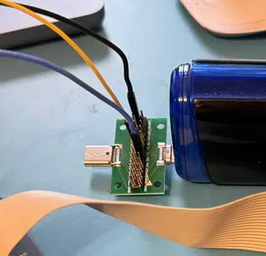

Above is how Praetorian and I wired it before the problem. Below is how I now have to connect the wires to get access to the SWD port.

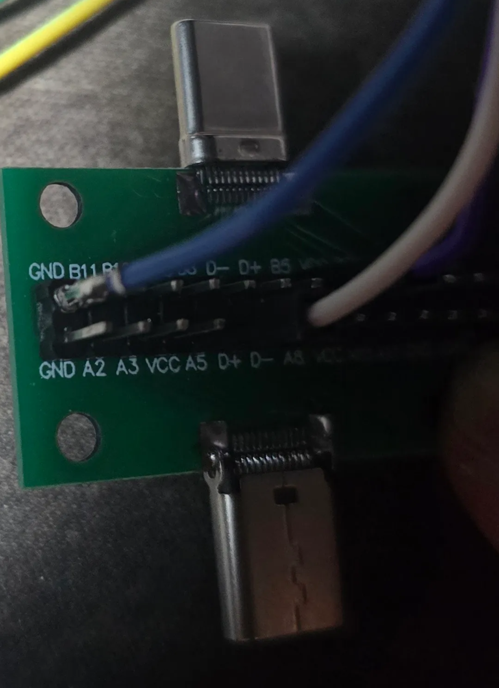

I have no idea what happened, but we can get back to work.

New wiring setup:

| SWD board | Type-C |
| --- | --- |
| SWDIO | CC1/A5 |
| SWCLK | CC2/B5 |
| GND | GND/B12 |

## EZ Mode

At some point, ImoverEngineering got Doom working on the same vape we were using: [Doom on RAZ LTX 25000](https://www.youtube.com/shorts/wNxx0KnQoTs). That means someone beat me to it. EXCEPT it uses custom firmware to stream Doom to it from another device.

Another thing this guy did was release an SDK that lets you flash anything to the vape. Which means all I have to do is get Doom on it without streaming to it.

[Imoverengineering Vaporware GitHub](https://github.com/Imoverengineering/Vaporware)

The first thing I had to do was see if the example worked on the vape I had. Using the guide on GitHub, I flashed it to the vape.

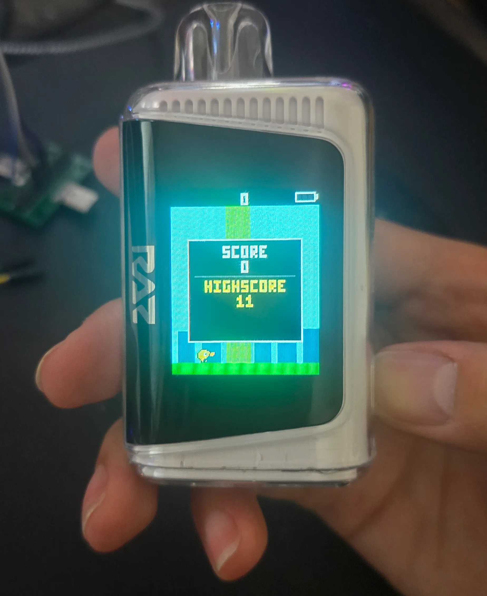

It works, kinda. You can play a Flappy Bird clone, but you can't use the vape to vape. Which would make sense, since the big warning sign noted that none of the examples use the coil, but you can control them if you want to.

## More Problems

So I ran into the main problem everyone probably runs into when putting Doom on an X device: storage space and RAM requirements. The RAZ DC/LTX 25000 vape has 64 KB of storage and 8 KB of SRAM. The pure Doom WAD can range from 2 MB to 12 MB, so it won't fit on the vape. Even if I got Doom to fit on the vape, how would I even control the game with only one button? ;-;

This means I have to cut out features such as levels, music, enemy logic, item pickups, and more. Then the idea hit me: since there is only one button, we could make a gallery shooter like every other arcade game, where the enemies come to you. I'm really bad with programming, but AI is good enough to get this part done. After two more weeks with AI, I got something passable.

## Building and Flashing Doom

Terminal 1:

```bash
bash build_doom.sh
python3 gen_direct_flash.py

sudo openocd -f /home/dave/Downloads/Vape/tigard-swd.cfg -f /home/dave/Downloads/Vape/vape_n32g01.openocd.cfg
```

Terminal 2:

```text
telnet localhost 4444

init
reset halt
tcl_port disabled; telnet_port disabled; gdb_port disabled
source direct_flash.tcl
reset run
shutdown
```

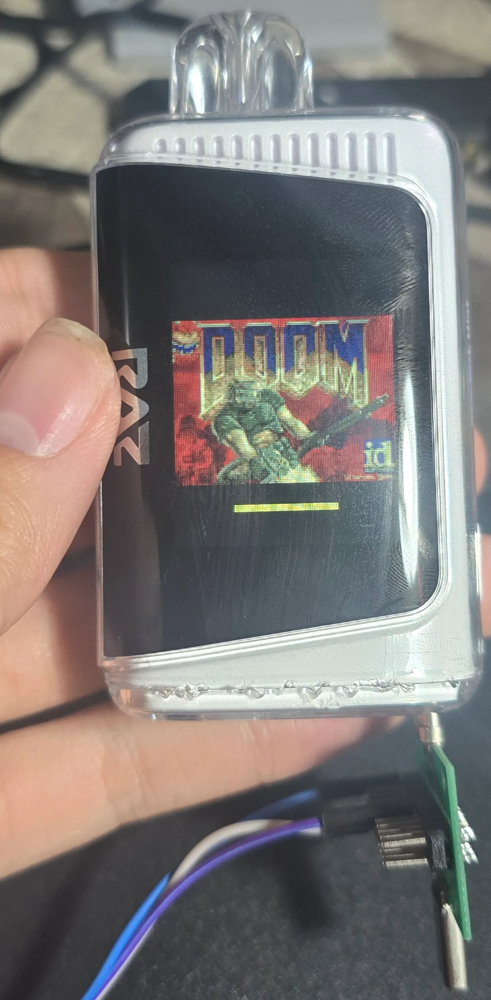

## It's Close Enough

I don't know what more to add to this port of Doom, since it is now taking up 60% to 70% of the 64 KB of space. I will let you guys figure that part out.

- [My demo video](https://www.youtube.com/watch?v=i7pJfO3N3c0)
- [My fork of Vaporware](https://github.com/Mason-lee-101/Vaporware)

> Note: I just want naps nows (- _ -)

## Sources

### Hardware research

- [Praetorian: Hardware Hacking a Nicotine Vape](https://www.praetorian.com/blog/hardware-hacking-a-nicotine-vape)
- [Nations N32G031 chip manual](https://www.nationstech.com/uploads/packs/1662539811646982.pdf)
- [RAZ-RE firmware and OpenOCD resources](https://github.com/xbenkozx/RAZ-RE)
- [ColorLCDVape-RE documentation](https://github.com/ginbot86/ColorLCDVape-RE)
- [RAZ vape teardown video](https://www.youtube.com/watch?v=dFn5By8aqM8)
- [Rip It Apart: Reverse Engineering a Disposable Vape](https://ripitapart.com/2024/04/20/dispo-adventures-episode-1-reverse-engineering-and-running-windows-95-on-a-disposable-vape-with-a-colour-lcd-screen/)
- [Reddit: RAZ 25000 vape hardware findings](https://www.reddit.com/r/hardwarehacking/comments/1g0omsu/posting_my_current_findings_on_the_raz_25000_vape/)

### Doom and firmware projects

- [Imoverengineering: Doom on RAZ LTX 25000 demo](https://www.instagram.com/reel/DYD4c9qs6EQ/)
- [Imoverengineering Vaporware SDK](https://github.com/Imoverengineering/Vaporware)
- [My Vaporware fork](https://github.com/Mason-lee-101/Vaporware)
